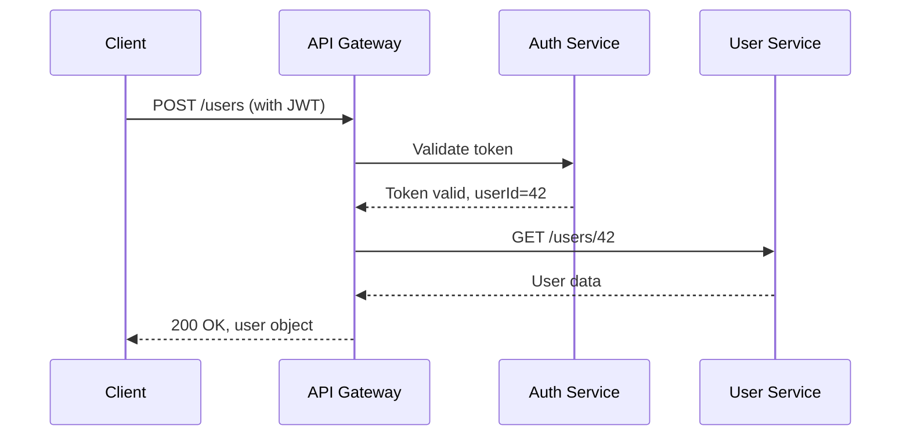

# Lesson 14: Technical Documentation

**Previous**: [DevOps and CI/CD](./13_DevOps_and_CICD.md) | **Next**: [Team Dynamics and Communication](./15_Team_Dynamics_and_Communication.md)

---

Documentation is code's memory. Code tells you *what* a system does; documentation tells you *why* it does it that way, *how* to use it, and *what* decisions were made along the road. Good documentation multiplies a team's effectiveness — it reduces the time spent answering repeated questions, enables faster onboarding, and preserves institutional knowledge that would otherwise leave when engineers move on. This lesson covers the types of documentation that matter in software engineering, how to write them well, and how to keep them from decaying into uselessness.

**Difficulty**: ⭐⭐

**Prerequisites**:
- [What Is Software Engineering](./01_What_Is_Software_Engineering.md) — understanding the software lifecycle
- Basic familiarity with Markdown syntax

**Learning Objectives**:
- Identify the distinct types of technical documentation and their audiences
- Apply the docs-as-code workflow to maintain documentation alongside source code
- Write an Architecture Decision Record (ADR) in standard format
- Describe the OpenAPI specification and how it enables API documentation
- Structure a README file effectively for a software project
- Apply the C4 model to create layered architecture diagrams
- Diagnose and address documentation rot
- Distinguish between runbooks and playbooks and know when to use each

---

## 1. Why Documentation Matters

The classic excuse is "the code is the documentation." This is true only if:
- The reader already understands the domain
- The reader has unlimited time to read all the code
- The code perfectly expresses all design intent and tradeoffs
- The system never needs to be operated, diagnosed, or evolved

In reality, none of these conditions hold. Documentation serves needs that code cannot:

**Audience expansion**: Not everyone who needs to understand a system can or should read its source code. Product managers, security auditors, new hires, and API consumers need structured, accessible descriptions.

**Preserving decisions**: Code shows the decision that was made; it cannot show the alternatives that were considered and rejected, or the constraints that ruled them out. Without that context, future engineers will repeat the same investigation or accidentally reverse a deliberate choice.

**Reducing bus factor**: The bus factor (or lottery factor) is the number of team members who could be "hit by a bus" before a project is in serious trouble. Documentation distributes knowledge that would otherwise be locked in individual heads.

**Accelerating onboarding**: A new team member with good documentation can become productive in days rather than weeks.

### The Cost of Poor Documentation

- **Repeated interruptions**: "Where do I find X?" — the same question answered five times a week by five different people
- **Incorrect assumptions**: Developers working on adjacent systems misunderstand boundaries and build on faulty assumptions
- **Fear of change**: Nobody wants to touch code they don't understand; well-documented code gets improved, undocumented code accumulates technical debt
- **Incidents that last longer**: When a system fails at 2 AM, an undocumented system requires hours of forensic archaeology; a documented system has a runbook

---

## 2. Types of Technical Documentation

Different audiences need different documents. Confusing these types leads to documents that serve no audience well.

### Requirements Documents

Capture *what* the system must do. Audiences: product managers, developers, testers, customers. Examples: Product Requirements Documents (PRDs), functional specifications, user story backlogs.

### Design Documents

Capture *how* the system will be built. Audiences: engineers working on or adjacent to the system. Examples: high-level design documents, low-level design documents, architecture diagrams.

Design documents are most valuable *before* implementation — they enable review of decisions before they are expensive to change — and *during* maintenance — they explain why a system was built a particular way.

### API Documentation

Describe how to use an interface programmatically. Audiences: developers consuming the API (internal or external). Examples: OpenAPI/Swagger specifications, generated reference docs, SDK guides.

### User Guides and Tutorials

Explain how to use the software to accomplish tasks. Audiences: end users or developers new to the system. Examples: getting started guides, how-to articles, reference manuals.

The distinction between tutorial (learning-oriented), how-to guide (task-oriented), explanation (understanding-oriented), and reference (information-oriented) — called the Diátaxis framework — helps structure these documents correctly.

### Operational Documentation

Explain how to run the system. Audiences: operations engineers, on-call developers. Examples: runbooks, playbooks, architecture overviews, capacity planning guides.

### Architecture Decision Records

Capture *why* a specific decision was made at a point in time. Audiences: current and future engineers. See Section 4 for full coverage.

---

## 3. Documentation as Code

"Docs as code" is the practice of treating documentation with the same discipline as source code:
- Documentation files live in the same repository as the code they describe
- Documentation changes are reviewed via pull requests
- Documentation is built and checked by CI pipelines (broken links, missing sections, outdated API references)
- Docs are versioned alongside releases

### Why Docs as Code Works

When documentation is separate from code — in a wiki, a shared drive, or a separate repository — it inevitably falls out of sync. The friction of switching contexts means updates to docs happen "later," and "later" often means never.

When documentation is in the same repository:
- Code and docs are reviewed together in the same pull request
- Automated checks can flag when code changes without corresponding doc updates
- Documentation history is linked to code history (git blame shows who wrote what and when)

### Formats

**Markdown** (`.md`): Most common for software projects. Widely supported by GitHub, GitLab, documentation generators, and rendering tools. Simple, readable in raw form.

**AsciiDoc** (`.adoc`): Richer feature set than Markdown — better support for tables, cross-references, and complex structures. Used by many open-source projects (Spring, Git documentation).

**reStructuredText** (`.rst`): Python community standard; used by Sphinx documentation generator.

### Documentation Generators

Static site generators transform Markdown/AsciiDoc files into navigable documentation websites:
- **MkDocs** (Python ecosystem) — simple, good for software documentation, Material theme is widely used
- **Sphinx** (Python) — powerful, excellent for API reference generation
- **Docusaurus** (JavaScript) — React-based, good for developer portals
- **Hugo / Jekyll** — general-purpose static site generators

### CI Checks for Documentation

A documentation pipeline can check:
- **Broken links**: Links to other pages or external URLs that no longer exist
- **Spell checking**: Common misspellings and typos
- **Required sections**: Does every public API have a description?
- **Freshness markers**: Documentation older than N months is flagged for review
- **Code sample validity**: Extract code blocks and run them; ensure they compile/execute without errors

---

## 4. Architecture Decision Records

An Architecture Decision Record (ADR) is a short document that captures an important architectural decision, the context in which it was made, the options considered, and the rationale for the choice.

### Why ADRs?

Code shows what was built. Design documents show how. ADRs capture *why* — specifically, why option A was chosen over options B and C, what constraints existed at the time, and what the known trade-offs are.

Without ADRs, teams repeatedly rediscover the same debates. A new engineer asks "why don't we use X instead?" The institutional answer is locked in the head of the engineer who made the original decision, who may have left the company. With an ADR, the answer is findable.

### ADR Format (Nygard Format)

The most common ADR format, introduced by Michael Nygard:

```markdown
# ADR-0012: Use PostgreSQL as the primary database

## Status
Accepted

## Context
We need a relational database to store user data, orders, and transaction history.
The system must support ACID transactions, complex queries, and full-text search.
The team has strong SQL experience but limited NoSQL experience. We are deploying
to AWS and want managed database support.

## Decision
We will use PostgreSQL (version 15+), hosted on AWS RDS.

## Consequences
**Positive:**
- Full ACID compliance for financial transactions
- Rich query capabilities including JSON, full-text search, and window functions
- Excellent AWS RDS support with automated backups and Multi-AZ failover
- Team familiarity reduces onboarding time

**Negative:**
- Horizontal write scaling requires additional complexity (read replicas, sharding)
- Not optimal for document-heavy workloads; MongoDB would be simpler for
  unstructured data if that becomes dominant
- RDS costs more than self-managed PostgreSQL for high I/O workloads

## Alternatives Considered
- **MySQL**: Rejected because team lacked familiarity and PostgreSQL has richer feature set
- **DynamoDB**: Rejected because our data has complex relational queries; NoSQL would require
  significant application-level join logic
- **MongoDB**: Rejected because our data is strongly relational; document model would not fit well
```

### ADR Lifecycle

ADRs have a **Status** field that evolves:
- **Proposed**: Under discussion, not yet adopted
- **Accepted**: The decision has been made and implemented
- **Deprecated**: The decision is no longer current but records historical context
- **Superseded by ADR-XXXX**: A newer ADR has replaced this one

ADRs are never deleted or retroactively edited to look correct. They are historical records. If a decision changes, write a new ADR and mark the old one as superseded.

### Where to Store ADRs

The most common location is `docs/adr/` or `doc/architecture/decisions/` within the repository. Some teams use a dedicated repository for organization-wide decisions. Tools like `adr-tools` (command-line) and the ADR GitHub Action automate ADR creation and indexing.

---

## 5. API Documentation

APIs — whether REST, GraphQL, gRPC, or library interfaces — are contracts. Documentation of that contract is essential for anyone consuming it.

### OpenAPI / Swagger

OpenAPI is the industry-standard specification format for REST APIs. An OpenAPI document (YAML or JSON) describes:
- Available endpoints and operations (GET /users/{id})
- Request parameters, headers, and body schemas
- Response schemas and status codes
- Authentication schemes
- Examples

```yaml
# Example OpenAPI 3.0 fragment
openapi: 3.0.3
info:
  title: User Service API
  version: 1.2.0

paths:
  /users/{userId}:
    get:
      summary: Retrieve a user by ID
      parameters:
        - name: userId
          in: path
          required: true
          schema:
            type: integer
      responses:
        '200':
          description: User found
          content:
            application/json:
              schema:
                $ref: '#/components/schemas/User'
              example:
                id: 42
                email: "alice@example.com"
                createdAt: "2024-01-15T09:30:00Z"
        '404':
          description: User not found

components:
  schemas:
    User:
      type: object
      properties:
        id:
          type: integer
        email:
          type: string
          format: email
        createdAt:
          type: string
          format: date-time
```

Tools like Swagger UI and Redoc render OpenAPI specs as interactive documentation, allowing developers to explore endpoints and make test calls directly from the browser.

### Code-Level Documentation

For library APIs, documentation lives in the source code as docstrings or doc comments:

```python
def retry(func, max_attempts=3, backoff_base=2.0, exceptions=(Exception,)):
    """
    Retry a function call with exponential backoff on failure.

    Args:
        func: Callable to retry. Must be idempotent.
        max_attempts: Maximum number of attempts before raising. Default: 3.
        backoff_base: Multiplier for wait time between attempts. Default: 2.0.
            Wait times: 1s, 2s, 4s, ... up to max_attempts.
        exceptions: Tuple of exception types that trigger a retry. Default: all exceptions.

    Returns:
        The return value of func() on success.

    Raises:
        The last exception raised by func() after max_attempts failures.

    Example:
        >>> result = retry(lambda: fetch_data(url), max_attempts=5)
    """
```

Tools like Sphinx (Python), Javadoc (Java), and godoc (Go) extract these comments to generate reference documentation automatically.

---

## 6. README Files

The README is the front door of a project. It is often the first — and sometimes the only — document a new user or contributor reads. A good README answers: "What is this? Can I use it? How do I start?"

### Essential Sections

```markdown
# Project Name

One or two sentence description of what this project does and who it is for.

## Features
- Bullet list of key capabilities

## Getting Started

### Prerequisites
- Node.js 18+
- PostgreSQL 15

### Installation
\`\`\`bash
git clone https://github.com/org/project
cd project
npm install
cp .env.example .env
npm run db:migrate
npm start
\`\`\`

## Usage
Brief example of the most common use case.

## Configuration
Table of environment variables and their defaults.

## Contributing
Link to CONTRIBUTING.md or brief contribution guide.

## License
MIT License — see LICENSE file.
```

**Common README mistakes**:
- Missing installation steps (assumes readers know the ecosystem)
- No examples (describes what it does but not how to use it)
- Outdated installation steps (README written once and never updated)
- Extremely long (trying to put everything in one file — use separate docs instead)
- No badges (build status, coverage, version — signal project health at a glance)

---

## 7. Diagrams

A well-chosen diagram communicates in seconds what paragraphs struggle to express. But diagrams have a maintenance problem: they are stored as binary files (PNG, SVG from a GUI tool), cannot be diff'd or reviewed in pull requests, and are expensive to update.

### Diagrams as Code

Diagrams as code tools accept text input and render diagrams, enabling version control and review:

**Mermaid**: Embedded in Markdown on GitHub, GitLab, and many wikis. Supports flowcharts, sequence diagrams, class diagrams, ER diagrams.



**PlantUML**: More feature-rich than Mermaid; widely used in enterprise documentation. Supports UML diagrams, C4 architecture diagrams.

**Structurizr**: Purpose-built for the C4 model (see below).

### The C4 Model

The C4 model (Simon Brown) provides four levels of abstraction for architecture documentation, each targeting a different audience:

| Level | Diagram Type | Audience | Shows |
|-------|-------------|---------|-------|
| 1 | System Context | Non-technical stakeholders | How the system fits into the wider environment (users, external systems) |
| 2 | Container | Technical team | High-level components: web app, API, database, message queue |
| 3 | Component | Developers | Components inside a container and their interactions |
| 4 | Code | Developers | Class/package level (usually auto-generated; only for complex components) |

The power of C4 is its hierarchy: you can show a stakeholder the Level 1 diagram and zoom into Level 2 or 3 for technical discussions, using consistent notation throughout.

---

## 8. Documentation Maintenance

Documentation that is not maintained becomes misleading — which is worse than no documentation. A reader who follows an outdated runbook and takes incorrect action can cause an incident.

### Documentation Rot

Documentation rot refers to the gradual decay of documentation as the system it describes changes without the documentation being updated. Signs of rot:
- Installation steps that no longer work
- API endpoints that have been renamed or removed
- Architecture diagrams showing components that were deprecated
- "TODO: fill this in" sections that were never completed

### Strategies to Combat Rot

**Ownership**: Every document has an owner responsible for keeping it accurate. Teams that share ownership of documentation with nobody accountable end up with no one updating it.

**Living documentation**: Wherever possible, generate documentation from the source of truth. API docs generated from code annotations are always in sync with the code. This is not always possible, but reducing manually-maintained documentation reduces rot.

**Docs review in PRs**: When code changes, the PR description should include documentation updates. Code reviewers should ask: "Does this change require a documentation update?"

**Scheduled reviews**: Set calendar reminders to review critical documentation (runbooks, architectural overviews) quarterly. Mark documents with `Last Reviewed: YYYY-MM-DD` to make staleness visible.

**Feedback links**: Every documentation page should have a simple mechanism for readers to signal that something is wrong — a GitHub issue link, a "Was this helpful?" button, or a Slack channel. Readers often discover rot before authors do.

---

## 9. Runbooks and Playbooks

Operational documentation is arguably the highest-value documentation investment because its consumers are under pressure (something is broken) and its absence has a direct cost (longer incidents).

### Runbooks

A runbook is a set of step-by-step instructions for performing a specific operational procedure. It is designed to be followed by an on-call engineer who may be unfamiliar with the system.

**Characteristics of a good runbook**:
- **Specific**: Covers exactly one scenario or alert
- **Actionable**: Every step has a concrete action (run this command, check this URL, escalate to this person)
- **Verified**: The steps have been tested and confirmed to work
- **Safe**: Steps that could cause harm are clearly marked; steps are ordered from safe to escalating risk

```markdown
# Runbook: High Database Connection Count Alert

## Alert
Alert Name: `db_connection_count_high`
Triggers when: PostgreSQL connection count > 80% of max_connections

## Impact
- New connections may be rejected
- Application may start returning 503 errors

## Diagnosis Steps

1. Check current connections:
   \`\`\`sql
   SELECT count(*), state FROM pg_stat_activity GROUP BY state;
   \`\`\`

2. Identify long-running queries:
   \`\`\`sql
   SELECT pid, now() - query_start AS duration, query
   FROM pg_stat_activity
   WHERE state = 'active' AND query_start < now() - interval '5 minutes'
   ORDER BY duration DESC;
   \`\`\`

3. Check application logs for connection pool errors:
   \`\`\`bash
   kubectl logs -l app=api-server --since=15m | grep -i "connection pool"
   \`\`\`

## Mitigation

**If long-running queries are the cause**: Terminate the blocking query (confirm impact first):
\`\`\`sql
SELECT pg_terminate_backend(pid);  -- pid from step 2
\`\`\`

**If connection pool misconfiguration is the cause**: Restart the affected pod:
\`\`\`bash
kubectl rollout restart deployment/api-server
\`\`\`

## Escalation
If not resolved within 15 minutes, escalate to the database team (#db-oncall).
File a postmortem if > 5 minutes of user-facing impact occurred.

## Related
- [ADR-0012: PostgreSQL as primary database](../architecture/decisions/0012-postgresql.md)
- [Connection pool configuration](../configuration.md#connection-pool)
```

### Playbooks

A playbook is broader than a runbook. Where a runbook handles a specific alert, a playbook describes how to handle a class of incidents (e.g., "Major Outage Playbook," "Security Breach Playbook"). Playbooks define roles (Incident Commander, Communications Lead), communication templates, escalation paths, and decision trees.

---

## 10. Internal Knowledge Bases

Beyond code repositories, teams accumulate knowledge in wikis and knowledge management systems.

### Wiki Platforms

- **Confluence** (Atlassian): Widely used in enterprise; integrates with Jira; rich formatting but can become a dumping ground
- **Notion**: Flexible structure; popular in startups; good for lightweight documentation
- **GitHub/GitLab Wiki**: Attached to repositories; Markdown-based; simple but limited structure
- **Docusaurus / MkDocs**: For documentation that needs a structured, navigable website

### Common Pitfalls of Wikis

**Discoverability problem**: Content in wikis is only useful if people can find it. Without consistent naming, tagging, and organization, wikis become graveyards of outdated pages that nobody reads.

**Duplicate content**: The same information in multiple places; when one is updated but others are not, readers get inconsistent answers. Apply the DRY principle to documentation: one authoritative source, link rather than duplicate.

**Formatting inconsistency**: Without templates and standards, every page looks different, making the wiki feel unprofessional and harder to parse.

---

## 11. Documentation Review Process

Documentation should be reviewed like code — before it is merged, not after.

### Review Checklist

- **Accuracy**: Is the information correct? Does it match the current behavior of the system?
- **Completeness**: Are all necessary steps, parameters, or exceptions covered?
- **Clarity**: Would someone unfamiliar with this system understand it? Avoid jargon that is not explained.
- **Examples**: Are there concrete examples for the key use cases?
- **Structure**: Is the content organized logically? Can a reader find what they need quickly?
- **Links**: Do all links work? Do they point to the current version of referenced documents?
- **Audience**: Is the document written for the right audience? (A runbook written for a domain expert is useless to a general on-call engineer)

---

## Summary

Technical documentation is a first-class engineering artifact, not an afterthought. The types of documentation — requirements, design, API, operational, and ADRs — serve different audiences and different phases of the software lifecycle.

Key practices:
- **Docs as code**: Documentation lives in the repository, is reviewed in PRs, and is checked by CI
- **ADRs** preserve the *why* behind architectural decisions, preventing teams from rehashing the same debates
- **OpenAPI** provides a machine-readable API contract that enables auto-generated interactive documentation
- **C4 model** provides a consistent, layered approach to architecture diagrams
- **Runbooks** reduce incident duration by giving on-call engineers clear, step-by-step guidance
- **Documentation rot** is inevitable without ownership, scheduled reviews, and integration into the development workflow

---

## Practice Exercises

1. **ADR Writing**: Choose a technology decision you have made or are familiar with (e.g., "use Redis for caching," "use REST instead of GraphQL"). Write a complete ADR for that decision in Nygard format, including context, the decision, at least two rejected alternatives with reasons, and concrete positive and negative consequences.

2. **README Audit**: Find an open-source project on GitHub with a README you think is poor. Identify specifically what is missing or unclear. Write a revised README outline for the project, with section headings and brief notes on what each section should contain.

3. **Runbook Creation**: Pick a common failure mode you have encountered (database connection error, disk full, service restart loop). Write a complete runbook for that alert, including diagnosis steps with actual commands, mitigation steps ordered by risk, and escalation criteria.

4. **API Documentation**: Design the OpenAPI specification for a simple bookmarking API with three endpoints: create bookmark, list bookmarks (with tag filtering), and delete bookmark. Include request/response schemas and at least one example per operation.

5. **Documentation Rot Analysis**: Examine a documentation source you have access to (your team's wiki, a project's README, API docs). Identify three specific examples of documentation rot. For each, describe: what is wrong, how a reader would be misled, and what process change would prevent the rot from recurring.

---

## Further Reading

- **Books**:
  - *Docs for Developers* — Jared Bhatti, Zachary Sarah Corleissen, Jen Lambourne, David Nunez, Heidi Waterhouse (practical guide for technical writers and developers)
  - *The Documentation System* — Diátaxis (diataxis.fr, free online) — framework distinguishing tutorials, how-tos, explanations, and references

- **Specifications and Standards**:
  - OpenAPI Specification — spec.openapis.org
  - C4 Model — c4model.com (Simon Brown)
  - ADR format — adr.github.io

- **Articles**:
  - "Architectural Decision Records" — Michael Nygard (thinkrelevance.com)
  - "Docs as Code" — Write the Docs community (writethedocs.org)
  - "The 12 Factor App Documentation" — 12factor.net (brief, influential operational documentation)
  - "Documentation Maturity Model" — Splunk blog

---

**Previous**: [DevOps and CI/CD](./13_DevOps_and_CICD.md) | **Next**: [Team Dynamics and Communication](./15_Team_Dynamics_and_Communication.md)
