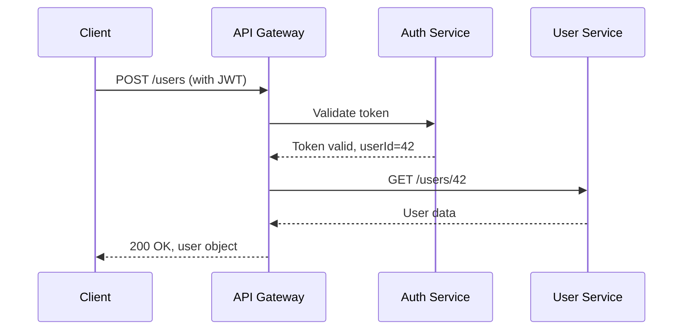

# 레슨 14: 기술 문서화(Technical Documentation)

**이전**: [DevOps와 CI/CD](./13_DevOps_and_CICD.md) | **다음**: [팀 역학과 커뮤니케이션](./15_Team_Dynamics_and_Communication.md)

---

문서는 코드의 기억이다. 코드는 시스템이 *무엇*을 하는지 알려주지만, 문서는 *왜* 그런 방식으로 동작하는지, *어떻게* 사용하는지, 그리고 개발 과정에서 *어떤* 결정이 내려졌는지 알려준다. 좋은 문서는 팀의 효율을 배가시킨다 — 반복적인 질문에 답하는 시간을 줄이고, 새 팀원의 온보딩(onboarding)을 가속화하며, 엔지니어가 이직할 때 함께 사라질 조직의 지식을 보존한다. 이 레슨에서는 소프트웨어 엔지니어링에서 중요한 문서의 유형, 잘 작성하는 방법, 그리고 문서가 점점 쓸모없어지는 것을 막는 방법을 다룬다.

**난이도**: ⭐⭐

**선수 학습**:
- [소프트웨어 엔지니어링이란](./01_What_Is_Software_Engineering.md) — 소프트웨어 생명주기 이해
- 마크다운 문법에 대한 기본 지식

**학습 목표**:
- 기술 문서의 각 유형과 해당 대상 독자를 식별한다
- 소스 코드와 함께 문서를 관리하는 코드로서의 문서(docs-as-code) 워크플로를 적용한다
- 표준 형식으로 아키텍처 결정 기록(Architecture Decision Record, ADR)을 작성한다
- OpenAPI 명세와 이것이 API 문서화를 어떻게 가능하게 하는지 설명한다
- 소프트웨어 프로젝트를 위한 README 파일을 효과적으로 구성한다
- C4 모델을 적용하여 계층적 아키텍처 다이어그램을 작성한다
- 문서 부패(documentation rot)를 진단하고 해결한다
- 런북(runbook)과 플레이북(playbook)의 차이를 구분하고 각각의 사용 시점을 파악한다

---

## 1. 문서가 중요한 이유

"코드가 곧 문서다"라는 전형적인 변명이 있다. 이것이 사실이 되려면:
- 독자가 이미 해당 도메인을 이해하고 있어야 하고
- 독자가 모든 코드를 읽을 무한한 시간이 있어야 하고
- 코드가 모든 설계 의도와 트레이드오프를 완벽하게 표현해야 하고
- 시스템을 운영하거나 진단하거나 발전시킬 필요가 없어야 한다

현실에서는 이 조건 중 어느 것도 성립하지 않는다. 문서는 코드가 충족할 수 없는 필요를 채운다:

**대상 범위 확장**: 시스템을 이해해야 하는 모든 사람이 소스 코드를 읽을 수 있거나 읽어야 하는 것은 아니다. 프로덕트 매니저, 보안 감사자, 신입 사원, API 사용자는 체계적이고 접근 가능한 설명이 필요하다.

**결정 사항 보존**: 코드는 어떤 결정이 내려졌는지 보여주지만, 검토 후 기각된 대안이나 그것을 배제한 제약 조건은 보여줄 수 없다. 그 맥락 없이는 미래의 엔지니어들이 동일한 탐구를 반복하거나 의도적인 선택을 실수로 되돌릴 수 있다.

**버스 팩터(bus factor) 감소**: 버스 팩터(혹은 복권 팩터)는 프로젝트가 심각한 위기에 처하기 전에 "버스에 치여도 되는" 팀원의 수다. 문서는 개인의 머릿속에 잠겨 있을 지식을 분산시킨다.

**온보딩 가속화**: 좋은 문서가 있는 팀의 신입 팀원은 몇 주가 아닌 며칠 만에 생산성을 발휘할 수 있다.

### 열악한 문서의 비용

- **반복적인 방해**: "X는 어디서 찾나요?" — 매주 다섯 명이 다섯 번 답하는 동일한 질문
- **잘못된 가정**: 인접 시스템을 개발하는 개발자들이 경계를 오해하고 잘못된 가정 위에 개발
- **변경에 대한 두려움**: 이해하지 못하는 코드는 아무도 건드리려 하지 않는다; 잘 문서화된 코드는 개선되고, 문서화되지 않은 코드는 기술 부채가 쌓인다
- **더 길어지는 인시던트**: 새벽 2시에 시스템이 장애를 일으킬 때, 문서화되지 않은 시스템은 수 시간의 포렌식 작업이 필요하다; 문서화된 시스템에는 런북이 있다

---

## 2. 기술 문서의 유형

서로 다른 독자에게는 서로 다른 문서가 필요하다. 이 유형들을 혼동하면 어느 독자도 만족시키지 못하는 문서가 만들어진다.

### 요구사항 문서(Requirements Documents)

시스템이 *무엇*을 해야 하는지 기록한다. 대상: 프로덕트 매니저, 개발자, 테스터, 고객. 예시: 제품 요구사항 문서(PRD), 기능 명세서, 사용자 스토리 백로그.

### 설계 문서(Design Documents)

시스템이 *어떻게* 구축될지 기록한다. 대상: 시스템을 개발하거나 인접한 시스템을 개발하는 엔지니어. 예시: 상위 수준 설계 문서, 하위 수준 설계 문서, 아키텍처 다이어그램.

설계 문서는 구현 *전*에 가장 가치 있다 — 변경 비용이 커지기 전에 결정을 검토할 수 있게 한다 — 그리고 *유지보수 중*에도 가치 있다 — 시스템이 특정 방식으로 구축된 이유를 설명한다.

### API 문서(API Documentation)

인터페이스를 프로그래밍 방식으로 사용하는 방법을 설명한다. 대상: API를 사용하는 개발자(내부 또는 외부). 예시: OpenAPI/Swagger 명세, 자동 생성된 레퍼런스 문서, SDK 가이드.

### 사용자 가이드 및 튜토리얼(User Guides and Tutorials)

작업을 수행하기 위해 소프트웨어를 사용하는 방법을 설명한다. 대상: 최종 사용자 또는 시스템에 처음 접하는 개발자. 예시: 시작하기 가이드, 방법 안내 문서, 레퍼런스 매뉴얼.

튜토리얼(학습 중심), 방법 안내 가이드(작업 중심), 설명(이해 중심), 레퍼런스(정보 중심)의 구분 — 다이어택시스(Diátaxis) 프레임워크라 불린다 — 은 이러한 문서를 올바르게 구성하는 데 도움을 준다.

### 운영 문서(Operational Documentation)

시스템을 어떻게 운영하는지 설명한다. 대상: 운영 엔지니어, 온콜(on-call) 개발자. 예시: 런북, 플레이북, 아키텍처 개요, 용량 계획 가이드.

### 아키텍처 결정 기록(Architecture Decision Records)

특정 시점에 특정 결정이 *왜* 내려졌는지 기록한다. 대상: 현재 및 미래의 엔지니어. 자세한 내용은 섹션 4를 참조.

---

## 3. 코드로서의 문서(Documentation as Code)

"코드로서의 문서(Docs as code)"는 문서를 소스 코드와 동일한 수준의 규율로 관리하는 관행이다:
- 문서 파일은 설명하는 코드와 동일한 저장소에 위치한다
- 문서 변경은 풀 리퀘스트(pull request)를 통해 검토된다
- CI 파이프라인이 문서를 빌드하고 검사한다 (깨진 링크, 누락된 섹션, 오래된 API 레퍼런스)
- 문서는 릴리스와 함께 버전 관리된다

### 코드로서의 문서가 효과적인 이유

문서가 코드와 별도로 존재할 때 — 위키, 공유 드라이브, 또는 별도 저장소 — 필연적으로 동기화가 깨진다. 컨텍스트 전환의 마찰로 인해 문서 업데이트는 "나중에" 발생하며, "나중에"는 종종 영원히 오지 않는다.

문서가 동일한 저장소에 있을 때:
- 코드와 문서가 동일한 풀 리퀘스트에서 함께 검토된다
- 자동화된 검사가 해당 문서 업데이트 없이 코드가 변경될 때 표시할 수 있다
- 문서 이력이 코드 이력과 연결된다 (git blame으로 누가 언제 무엇을 작성했는지 확인 가능)

### 형식

**마크다운(Markdown)** (`.md`): 소프트웨어 프로젝트에서 가장 일반적. GitHub, GitLab, 문서 생성기, 렌더링 도구에서 광범위하게 지원. 원본 형태로도 읽기 쉽다.

**AsciiDoc** (`.adoc`): 마크다운보다 풍부한 기능 — 테이블, 상호 참조, 복잡한 구조에 대한 더 나은 지원. 많은 오픈소스 프로젝트에서 사용 (Spring, Git 문서).

**reStructuredText** (`.rst`): Python 커뮤니티 표준; Sphinx 문서 생성기에서 사용.

### 문서 생성기(Documentation Generators)

정적 사이트 생성기는 마크다운/AsciiDoc 파일을 탐색 가능한 문서 웹사이트로 변환한다:
- **MkDocs** (Python 생태계) — 간단하고 소프트웨어 문서화에 적합, Material 테마가 널리 사용됨
- **Sphinx** (Python) — 강력하고 API 레퍼런스 생성에 탁월
- **Docusaurus** (JavaScript) — React 기반, 개발자 포털에 적합
- **Hugo / Jekyll** — 범용 정적 사이트 생성기

### 문서를 위한 CI 검사

문서 파이프라인은 다음을 검사할 수 있다:
- **깨진 링크**: 더 이상 존재하지 않는 다른 페이지나 외부 URL로의 링크
- **철자 검사**: 일반적인 오탈자
- **필수 섹션**: 모든 공개 API에 설명이 있는가?
- **최신성 마커**: N개월 이상 된 문서에 검토 플래그 지정
- **코드 샘플 유효성**: 코드 블록을 추출하여 실행; 컴파일/실행 오류 없이 작동하는지 확인

---

## 4. 아키텍처 결정 기록(Architecture Decision Records)

아키텍처 결정 기록(ADR)은 중요한 아키텍처 결정, 그 결정이 내려진 맥락, 검토된 옵션, 그리고 선택의 근거를 기록하는 짧은 문서다.

### ADR이 필요한 이유

코드는 무엇이 구축되었는지 보여준다. 설계 문서는 어떻게를 보여준다. ADR은 *왜*를 기록한다 — 구체적으로, 옵션 B와 C 대신 옵션 A가 선택된 이유, 당시 존재했던 제약 조건, 알려진 트레이드오프가 무엇인지.

ADR 없이는 팀이 동일한 논쟁을 반복적으로 재발견한다. 새 엔지니어가 "왜 X를 사용하지 않나요?"라고 묻는다. 조직의 답은 원래 결정을 내린 엔지니어의 머릿속에 잠겨 있고, 그 엔지니어는 이미 회사를 떠났을 수 있다. ADR이 있으면 답을 찾을 수 있다.

### ADR 형식 (나이가드 형식)

마이클 나이가드(Michael Nygard)가 도입한 가장 일반적인 ADR 형식:

```markdown
# ADR-0012: Use PostgreSQL as the primary database

## Status
Accepted

## Context
We need a relational database to store user data, orders, and transaction history.
The system must support ACID transactions, complex queries, and full-text search.
The team has strong SQL experience but limited NoSQL experience. We are deploying
to AWS and want managed database support.

## Decision
We will use PostgreSQL (version 15+), hosted on AWS RDS.

## Consequences
**Positive:**
- Full ACID compliance for financial transactions
- Rich query capabilities including JSON, full-text search, and window functions
- Excellent AWS RDS support with automated backups and Multi-AZ failover
- Team familiarity reduces onboarding time

**Negative:**
- Horizontal write scaling requires additional complexity (read replicas, sharding)
- Not optimal for document-heavy workloads; MongoDB would be simpler for
  unstructured data if that becomes dominant
- RDS costs more than self-managed PostgreSQL for high I/O workloads

## Alternatives Considered
- **MySQL**: Rejected because team lacked familiarity and PostgreSQL has richer feature set
- **DynamoDB**: Rejected because our data has complex relational queries; NoSQL would require
  significant application-level join logic
- **MongoDB**: Rejected because our data is strongly relational; document model would not fit well
```

### ADR 생명주기

ADR에는 변화하는 **상태(Status)** 필드가 있다:
- **제안됨(Proposed)**: 논의 중, 아직 채택되지 않음
- **수락됨(Accepted)**: 결정이 내려지고 구현됨
- **폐기됨(Deprecated)**: 결정이 더 이상 현재 상태가 아니지만 역사적 맥락을 기록
- **ADR-XXXX로 대체됨(Superseded by ADR-XXXX)**: 더 새로운 ADR이 이것을 대체함

ADR은 절대 삭제하거나 소급하여 수정하지 않는다. ADR은 역사적 기록이다. 결정이 변경되면, 새로운 ADR을 작성하고 기존 것을 대체됨으로 표시한다.

### ADR 저장 위치

가장 일반적인 위치는 저장소 내의 `docs/adr/` 또는 `doc/architecture/decisions/`다. 일부 팀은 조직 전체의 결정을 위해 전용 저장소를 사용한다. `adr-tools` (커맨드라인)와 ADR GitHub Action 같은 도구가 ADR 생성 및 인덱싱을 자동화한다.

---

## 5. API 문서화(API Documentation)

REST, GraphQL, gRPC, 라이브러리 인터페이스 등 API는 계약이다. 그 계약의 문서화는 API를 사용하는 모든 사람에게 필수적이다.

### OpenAPI / Swagger

OpenAPI는 REST API의 산업 표준 명세 형식이다. OpenAPI 문서 (YAML 또는 JSON)는 다음을 설명한다:
- 사용 가능한 엔드포인트와 작업 (GET /users/{id})
- 요청 파라미터, 헤더, 바디 스키마
- 응답 스키마와 상태 코드
- 인증 방식
- 예제

```yaml
# Example OpenAPI 3.0 fragment
openapi: 3.0.3
info:
  title: User Service API
  version: 1.2.0

paths:
  /users/{userId}:
    get:
      summary: Retrieve a user by ID
      parameters:
        - name: userId
          in: path
          required: true
          schema:
            type: integer
      responses:
        '200':
          description: User found
          content:
            application/json:
              schema:
                $ref: '#/components/schemas/User'
              example:
                id: 42
                email: "alice@example.com"
                createdAt: "2024-01-15T09:30:00Z"
        '404':
          description: User not found

components:
  schemas:
    User:
      type: object
      properties:
        id:
          type: integer
        email:
          type: string
          format: email
        createdAt:
          type: string
          format: date-time
```

Swagger UI와 Redoc 같은 도구는 OpenAPI 명세를 대화형 문서로 렌더링하여, 개발자가 브라우저에서 직접 엔드포인트를 탐색하고 테스트 호출을 할 수 있게 한다.

### 코드 수준의 문서화(Code-Level Documentation)

라이브러리 API의 경우, 문서는 소스 코드의 독스트링(docstring)이나 문서 주석(doc comment)으로 존재한다:

```python
def retry(func, max_attempts=3, backoff_base=2.0, exceptions=(Exception,)):
    """
    Retry a function call with exponential backoff on failure.

    Args:
        func: Callable to retry. Must be idempotent.
        max_attempts: Maximum number of attempts before raising. Default: 3.
        backoff_base: Multiplier for wait time between attempts. Default: 2.0.
            Wait times: 1s, 2s, 4s, ... up to max_attempts.
        exceptions: Tuple of exception types that trigger a retry. Default: all exceptions.

    Returns:
        The return value of func() on success.

    Raises:
        The last exception raised by func() after max_attempts failures.

    Example:
        >>> result = retry(lambda: fetch_data(url), max_attempts=5)
    """
```

Sphinx (Python), Javadoc (Java), godoc (Go) 같은 도구는 이러한 주석을 추출하여 레퍼런스 문서를 자동으로 생성한다.

---

## 6. README 파일(README Files)

README는 프로젝트의 정문이다. 새로운 사용자나 기여자가 읽는 첫 번째, 때로는 유일한 문서다. 좋은 README는 이런 질문에 답한다: "이게 무엇인가? 내가 사용할 수 있나? 어떻게 시작하나?"

### 필수 섹션

```markdown
# Project Name

One or two sentence description of what this project does and who it is for.

## Features
- Bullet list of key capabilities

## Getting Started

### Prerequisites
- Node.js 18+
- PostgreSQL 15

### Installation
\`\`\`bash
git clone https://github.com/org/project
cd project
npm install
cp .env.example .env
npm run db:migrate
npm start
\`\`\`

## Usage
Brief example of the most common use case.

## Configuration
Table of environment variables and their defaults.

## Contributing
Link to CONTRIBUTING.md or brief contribution guide.

## License
MIT License — see LICENSE file.
```

**일반적인 README 실수**:
- 설치 단계 누락 (독자가 생태계를 이미 안다고 가정)
- 예제 없음 (무엇을 하는지 설명하지만 어떻게 사용하는지 설명 안 함)
- 오래된 설치 단계 (README를 한 번 작성하고 업데이트하지 않음)
- 너무 길다 (모든 것을 한 파일에 넣으려 함 — 별도의 문서로 분리)
- 배지(badge) 없음 (빌드 상태, 커버리지, 버전 — 프로젝트 건강 상태를 한눈에 표시)

---

## 7. 다이어그램(Diagrams)

잘 선택된 다이어그램은 문단이 힘겹게 표현하는 것을 몇 초 만에 전달한다. 그러나 다이어그램에는 유지보수 문제가 있다: 바이너리 파일 (GUI 도구로 만든 PNG, SVG)로 저장되어 풀 리퀘스트에서 diff나 검토를 할 수 없으며, 업데이트 비용이 높다.

### 코드로서의 다이어그램(Diagrams as Code)

코드로서의 다이어그램 도구는 텍스트 입력을 받아 다이어그램을 렌더링하여 버전 관리 및 검토를 가능하게 한다:

**Mermaid**: GitHub, GitLab, 많은 위키에서 마크다운에 내장. 플로차트, 시퀀스 다이어그램, 클래스 다이어그램, ER 다이어그램을 지원.



**PlantUML**: Mermaid보다 기능이 풍부하며 기업 문서화에 널리 사용. UML 다이어그램, C4 아키텍처 다이어그램을 지원.

**Structurizr**: C4 모델을 위해 특별히 제작됨 (아래 참조).

### C4 모델(The C4 Model)

C4 모델(사이먼 브라운(Simon Brown) 제안)은 아키텍처 문서화를 위한 네 가지 추상화 수준을 제공하며, 각 수준은 서로 다른 대상을 대상으로 한다:

| 수준 | 다이어그램 유형 | 대상 | 표시 내용 |
|------|----------------|------|----------|
| 1 | 시스템 컨텍스트(System Context) | 비기술적 이해관계자 | 더 넓은 환경에서 시스템이 어떻게 위치하는지 (사용자, 외부 시스템) |
| 2 | 컨테이너(Container) | 기술 팀 | 고수준 컴포넌트: 웹 앱, API, 데이터베이스, 메시지 큐 |
| 3 | 컴포넌트(Component) | 개발자 | 컨테이너 내부의 컴포넌트와 그 상호작용 |
| 4 | 코드(Code) | 개발자 | 클래스/패키지 수준 (보통 자동 생성; 복잡한 컴포넌트에만 사용) |

C4의 장점은 계층 구조에 있다: 이해관계자에게 수준 1 다이어그램을 보여주고, 기술적 논의를 위해 수준 2나 3으로 확대할 수 있으며, 전체에 걸쳐 일관된 표기법을 사용한다.

---

## 8. 문서 유지보수(Documentation Maintenance)

유지보수되지 않는 문서는 오해를 낳는다 — 이것은 문서가 없는 것보다 더 나쁘다. 오래된 런북을 따라 잘못된 조치를 취한 독자는 인시던트를 일으킬 수 있다.

### 문서 부패(Documentation Rot)

문서 부패는 설명하는 시스템은 변경되었지만 문서가 업데이트되지 않아 점진적으로 문서가 부정확해지는 현상을 말한다. 부패의 징후:
- 더 이상 작동하지 않는 설치 단계
- 이름이 변경되거나 제거된 API 엔드포인트
- 폐기된 컴포넌트를 보여주는 아키텍처 다이어그램
- 완성되지 않은 "TODO: 내용 추가" 섹션

### 부패를 막는 전략

**소유권**: 모든 문서에는 정확성을 유지할 책임이 있는 소유자가 있다. 책임자 없이 문서를 공동으로 소유하는 팀은 결국 아무도 업데이트하지 않게 된다.

**리빙 문서화(Living documentation)**: 가능한 한 진실의 원천(source of truth)에서 문서를 생성한다. 코드 애너테이션에서 생성된 API 문서는 항상 코드와 동기화된다. 항상 가능한 것은 아니지만, 수동으로 유지되는 문서를 줄이면 부패가 줄어든다.

**PR에서의 문서 검토**: 코드가 변경될 때, PR 설명에 문서 업데이트가 포함되어야 한다. 코드 리뷰어는 "이 변경이 문서 업데이트를 필요로 하는가?"라고 물어야 한다.

**정기적인 검토**: 중요한 문서(런북, 아키텍처 개요)를 분기별로 검토하는 캘린더 알림을 설정한다. 오래됨을 가시화하기 위해 `마지막 검토: YYYY-MM-DD`로 문서를 표시한다.

**피드백 링크**: 모든 문서 페이지에는 독자가 문제가 있음을 알릴 수 있는 간단한 메커니즘이 있어야 한다 — GitHub 이슈 링크, "도움이 되었나요?" 버튼, 또는 슬랙 채널. 독자는 종종 작성자보다 먼저 부패를 발견한다.

---

## 9. 런북(Runbooks)과 플레이북(Playbooks)

운영 문서는 아마도 가장 높은 가치의 문서 투자일 것이다. 왜냐하면 사용자가 압박을 받는 상황(무언가 고장난 상황)에서 문서를 사용하며, 문서의 부재는 직접적인 비용(더 긴 인시던트)을 초래하기 때문이다.

### 런북(Runbooks)

런북은 특정 운영 절차를 수행하기 위한 단계별 지침 모음이다. 시스템에 익숙하지 않을 수 있는 온콜 엔지니어가 따를 수 있도록 설계되어 있다.

**좋은 런북의 특성**:
- **구체적**: 정확히 하나의 시나리오 또는 알림을 다룬다
- **실행 가능**: 모든 단계에 구체적인 조치가 있다 (이 명령을 실행하고, 이 URL을 확인하고, 이 사람에게 에스컬레이션)
- **검증됨**: 단계들이 테스트되고 작동이 확인됨
- **안전**: 피해를 줄 수 있는 단계는 명확하게 표시됨; 단계는 안전한 것부터 위험도가 높은 것 순으로 정렬됨

```markdown
# Runbook: High Database Connection Count Alert

## Alert
Alert Name: `db_connection_count_high`
Triggers when: PostgreSQL connection count > 80% of max_connections

## Impact
- New connections may be rejected
- Application may start returning 503 errors

## Diagnosis Steps

1. Check current connections:
   \`\`\`sql
   SELECT count(*), state FROM pg_stat_activity GROUP BY state;
   \`\`\`

2. Identify long-running queries:
   \`\`\`sql
   SELECT pid, now() - query_start AS duration, query
   FROM pg_stat_activity
   WHERE state = 'active' AND query_start < now() - interval '5 minutes'
   ORDER BY duration DESC;
   \`\`\`

3. Check application logs for connection pool errors:
   \`\`\`bash
   kubectl logs -l app=api-server --since=15m | grep -i "connection pool"
   \`\`\`

## Mitigation

**If long-running queries are the cause**: Terminate the blocking query (confirm impact first):
\`\`\`sql
SELECT pg_terminate_backend(pid);  -- pid from step 2
\`\`\`

**If connection pool misconfiguration is the cause**: Restart the affected pod:
\`\`\`bash
kubectl rollout restart deployment/api-server
\`\`\`

## Escalation
If not resolved within 15 minutes, escalate to the database team (#db-oncall).
File a postmortem if > 5 minutes of user-facing impact occurred.

## Related
- [ADR-0012: PostgreSQL as primary database](../architecture/decisions/0012-postgresql.md)
- [Connection pool configuration](../configuration.md#connection-pool)
```

### 플레이북(Playbooks)

플레이북은 런북보다 범위가 넓다. 런북이 특정 알림을 처리하는 반면, 플레이북은 인시던트의 종류를 어떻게 처리할지 설명한다 (예: "주요 장애 플레이북", "보안 침해 플레이북"). 플레이북은 역할(인시던트 지휘관, 커뮤니케이션 책임자), 커뮤니케이션 템플릿, 에스컬레이션 경로, 의사결정 트리를 정의한다.

---

## 10. 내부 지식 베이스(Internal Knowledge Bases)

코드 저장소 외에, 팀은 위키와 지식 관리 시스템에 지식을 축적한다.

### 위키 플랫폼(Wiki Platforms)

- **Confluence** (Atlassian): 기업에서 널리 사용; Jira와 통합; 풍부한 서식이지만 쓰레기장이 될 수 있음
- **Notion**: 유연한 구조; 스타트업에서 인기; 가벼운 문서화에 적합
- **GitHub/GitLab Wiki**: 저장소에 첨부; 마크다운 기반; 간단하지만 구조가 제한적
- **Docusaurus / MkDocs**: 구조화된 탐색 가능한 웹사이트가 필요한 문서에 적합

### 위키의 일반적인 함정

**발견 가능성 문제**: 위키의 콘텐츠는 찾을 수 있을 때만 유용하다. 일관된 이름 지정, 태깅, 구성 없이는 위키가 아무도 읽지 않는 오래된 페이지의 공동묘지가 된다.

**중복 콘텐츠**: 여러 위치에 동일한 정보; 하나는 업데이트되었지만 다른 것들은 그렇지 않을 때, 독자들은 일관성 없는 답을 받는다. DRY 원칙을 문서화에 적용: 하나의 권위 있는 출처, 중복이 아닌 링크.

**형식 불일치**: 템플릿과 표준 없이는 모든 페이지가 달라 보이며, 위키가 전문적이지 않고 파악하기 어렵게 느껴진다.

---

## 11. 문서 검토 프로세스(Documentation Review Process)

문서는 병합 후가 아닌, 병합 전에 코드처럼 검토되어야 한다.

### 검토 체크리스트

- **정확성**: 정보가 올바른가? 시스템의 현재 동작과 일치하는가?
- **완전성**: 모든 필수 단계, 파라미터, 예외가 다루어졌는가?
- **명확성**: 시스템에 익숙하지 않은 사람이 이해할 수 있는가? 설명되지 않은 전문 용어를 피하라.
- **예제**: 주요 사용 사례에 대한 구체적인 예제가 있는가?
- **구조**: 콘텐츠가 논리적으로 구성되어 있는가? 독자가 필요한 것을 빠르게 찾을 수 있는가?
- **링크**: 모든 링크가 작동하는가? 참조된 문서의 현재 버전을 가리키는가?
- **대상**: 문서가 올바른 대상을 위해 작성되었는가? (도메인 전문가를 위해 작성된 런북은 일반 온콜 엔지니어에게 무용하다)

---

## 요약

기술 문서화는 나중에 생각할 것이 아닌 일급 엔지니어링 산출물이다. 요구사항, 설계, API, 운영, ADR 등 문서의 유형은 서로 다른 대상과 소프트웨어 생명주기의 서로 다른 단계를 위한 것이다.

핵심 관행:
- **코드로서의 문서**: 문서는 저장소에 존재하고, PR에서 검토되며, CI에서 검사된다
- **ADR**은 아키텍처 결정 뒤의 *이유*를 보존하여 팀이 동일한 논쟁을 반복하는 것을 방지한다
- **OpenAPI**는 자동 생성된 대화형 문서를 가능하게 하는 기계 읽기 가능한 API 계약을 제공한다
- **C4 모델**은 아키텍처 다이어그램에 대한 일관되고 계층적인 접근 방식을 제공한다
- **런북**은 온콜 엔지니어에게 명확한 단계별 지침을 제공하여 인시던트 지속 시간을 줄인다
- **문서 부패**는 소유권, 정기적인 검토, 개발 워크플로에의 통합 없이는 불가피하다

---

## 연습 문제

1. **ADR 작성**: 자신이 내렸거나 알고 있는 기술 결정을 선택하라 (예: "캐싱에 Redis 사용", "GraphQL 대신 REST 사용"). 그 결정에 대한 완전한 ADR을 나이가드 형식으로 작성하라. 맥락, 결정, 이유가 있는 기각된 대안 두 개 이상, 그리고 구체적인 긍정적/부정적 결과를 포함하라.

2. **README 감사**: GitHub에서 품질이 낮다고 생각하는 README를 가진 오픈소스 프로젝트를 찾아라. 무엇이 누락되었거나 불명확한지 구체적으로 파악하라. 각 섹션의 제목과 포함되어야 할 내용에 대한 간략한 메모와 함께 수정된 README 개요를 작성하라.

3. **런북 작성**: 자신이 경험한 일반적인 장애 모드를 선택하라 (데이터베이스 연결 오류, 디스크 가득 참, 서비스 재시작 루프). 그 알림에 대한 완전한 런북을 작성하라. 실제 명령을 포함한 진단 단계, 위험도 순으로 정렬된 완화 단계, 에스컬레이션 기준을 포함하라.

4. **API 문서화**: 세 개의 엔드포인트가 있는 간단한 북마크 API의 OpenAPI 명세를 설계하라: 북마크 생성, 북마크 목록 조회(태그 필터링 포함), 북마크 삭제. 요청/응답 스키마와 각 작업에 최소 하나의 예제를 포함하라.

5. **문서 부패 분석**: 접근할 수 있는 문서 소스를 검토하라 (팀의 위키, 프로젝트의 README, API 문서). 문서 부패의 세 가지 구체적인 예를 파악하라. 각각에 대해: 무엇이 잘못되었는지, 독자가 어떻게 오해할 수 있는지, 그리고 부패의 재발을 방지할 프로세스 변경이 무엇인지 설명하라.

---

## 더 읽을거리

- **서적**:
  - *Docs for Developers* — Jared Bhatti, Zachary Sarah Corleissen, Jen Lambourne, David Nunez, Heidi Waterhouse (기술 작가와 개발자를 위한 실용 가이드)
  - *The Documentation System* — Diátaxis (diataxis.fr, 무료 온라인) — 튜토리얼, 방법 안내, 설명, 레퍼런스를 구분하는 프레임워크

- **명세 및 표준**:
  - OpenAPI 명세 — spec.openapis.org
  - C4 모델 — c4model.com (사이먼 브라운)
  - ADR 형식 — adr.github.io

- **기사**:
  - "Architectural Decision Records" — Michael Nygard (thinkrelevance.com)
  - "Docs as Code" — Write the Docs 커뮤니티 (writethedocs.org)
  - "The 12 Factor App Documentation" — 12factor.net (간결하고 영향력 있는 운영 문서)
  - "Documentation Maturity Model" — Splunk 블로그

---

**이전**: [DevOps와 CI/CD](./13_DevOps_and_CICD.md) | **다음**: [팀 역학과 커뮤니케이션](./15_Team_Dynamics_and_Communication.md)
